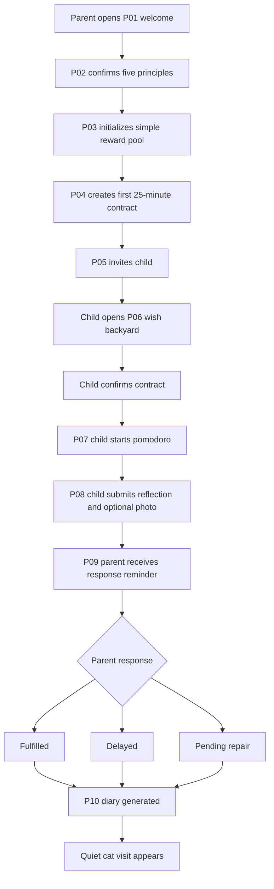

# Reward MVP User Flows

> Source of truth for Prompt 10 user flow design.

## Main MVP Loop

## Parent Flow

### P01 家长欢迎页

Parent starts the family setup and enters the MVP path.

Primary action:

- Start family setup.

Exit condition:

- Family draft exists.

### P02 原则确认页

Parent confirms the five principles before creating rewards or contracts.

Primary action:

- Confirm principles.

Validation:

- Parent must explicitly confirm all principles.

Exit condition:

- Principle confirmation record exists.

### P03 奖池初始化页

Parent creates a small reward pool.

Primary action:

- Add small wish items.

Validation:

- Block cash, gift card, merchant purchase, school reward, and surveillance-style reward wording.

Exit condition:

- Reward pool has at least one safe small wish.

### P04 创建首个小约定页

Parent creates the first 25-minute wish pomodoro contract.

Primary action:

- Create contract from template.

Validation:

- Must use supported template fields.
- Confirmed content creates ContractVersion.
- Unsafe or unmodelable contract wording is blocked.

Exit condition:

- Contract is created and ready for child confirmation.

### P05 孩子邀请页

Parent invites child through a controlled family invitation.

Primary action:

- Generate child invitation.

Validation:

- Invitation is scoped to this family only.
- No open social sharing is required in MVP.

Exit condition:

- Child can enter the family space.

### P09 家长兑现提醒页

Parent receives a reminder after child completion.

Primary actions:

- Mark fulfilled.
- Mark delayed.
- Mark pending repair.
- Add parent message.

Validation:

- Parent cannot edit the child's reflection.
- Parent cannot view ChildNote.
- Response writes AuditLog.

Exit condition:

- Parent response is saved and diary generation can run.

## Child Flow

### P06 孩子愿望后院首页

Child sees available small wishes and the first contract entry.

Primary action:

- Open the first contract.

Validation:

- Child sees only family-scoped content.
- Child does not see parent-only setup controls.

Exit condition:

- Child enters contract confirmation.

### Contract Confirmation

Child confirms the contract before execution starts.

Primary action:

- Confirm contract.

Validation:

- Confirmed ContractVersion becomes immutable.
- Later edits require a new version.

Exit condition:

- Contract status becomes confirmed.

### P07 愿望番茄钟页

Child actively starts the 25-minute pomodoro.

Primary actions:

- Start.
- Exit with reason.
- Complete after timer condition.

Validation:

- Timer must be started by child action.
- Exit reason is required for early exit.
- No hard lock or device control is used.

Exit condition:

- Contract status becomes completed or exited.

### P08 完成提交页

Child submits completion reflection.

Primary actions:

- Submit one-sentence reflection.
- Optionally attach one light photo placeholder.
- Optionally write one private ChildNote.

Validation:

- Reflection is required.
- Evidence is optional.
- ChildNote is private and parent-invisible.
- No AI auto-alert is triggered from ChildNote.

Exit condition:

- Completion submission is saved and parent reminder is created.

## Witness Flow

Witness is only used as a memorial placeholder in MVP.

Primary actions:

- Open limited completion summary.
- Send one blessing-style message.

Validation:

- Witness cannot view reward amount.
- Witness cannot view evidence photo.
- Witness cannot view ChildNote.
- Witness cannot view delayed or pending repair details.
- Witness cannot judge, vote, rank, compare, or arbitrate.

Exit condition:

- Blessing is attached to the memory surface.

## Exception Flows

### Unsafe Reward Or Contract

Trigger:

- User enters school/institution, cash/merchant, surveillance, open social, or unsupported AI/judgment wording.

System behavior:

- Block save.
- Show gentle rewrite copy.
- Do not create ContractVersion.
- Write validation event only when it does not contain sensitive raw child text.

### Child Exits Pomodoro

Trigger:

- Child taps exit before completion.

System behavior:

- Require a reason.
- Save status as exited.
- Notify parent with neutral copy.
- Do not shame, rank, or compare.

### Parent Delays Fulfillment

Trigger:

- Parent selects delayed.

System behavior:

- Require a short delay note or expected time.
- Generate diary with honest delayed state.
- Do not present delay as failure.

### Parent Selects Pending Repair

Trigger:

- Parent believes the promise needs discussion before fulfillment.

System behavior:

- Save pending_repair.
- Keep copy neutral.
- Do not expose this state to witness.
- Do not auto-judge either side.

### ChildNote Privacy

Trigger:

- Child writes private ChildNote.

System behavior:

- Save note as child-private data.
- Hide from parent and witness.
- Do not use note for AI auto-alert or parent push.

## Done When

- Parent, child, witness, and system flows are separately understandable.
- Every core step maps to one of the ten MVP pages or a named state transition.
- Exception flows cover unsafe input, child exit, delayed fulfillment, pending repair, and ChildNote privacy.
- The flow preserves the product boundaries: no school, no escrow, no surveillance, no open child social, no AI judge.
